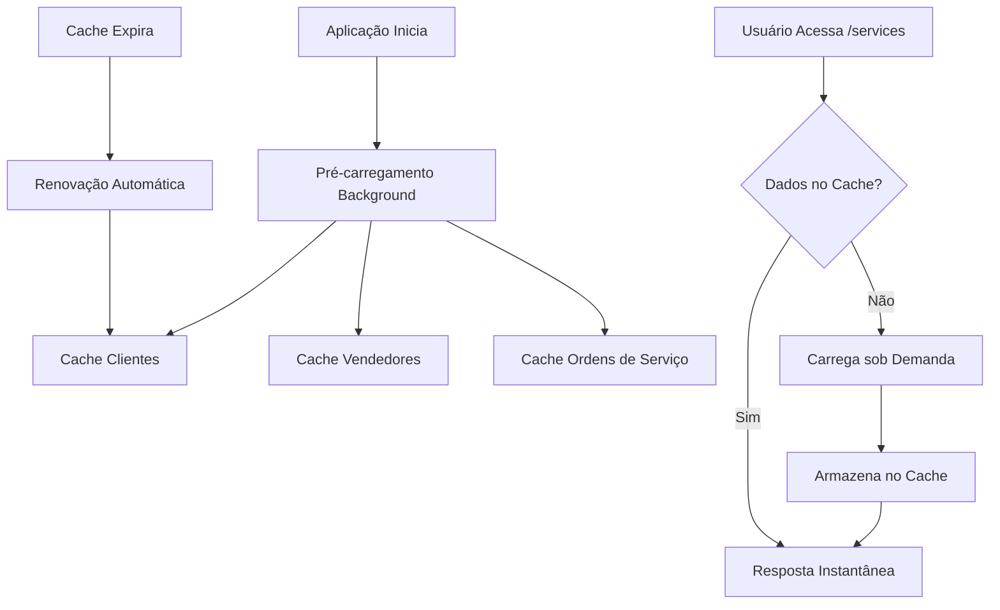

# Solução Final para Timeout - Dados Completos Sem Limitações

## Problema Original

O erro `WORKER TIMEOUT` ocorria porque a aplicação tentava carregar todos os dados simultaneamente na primeira requisição, causando timeout no Gunicorn.

## Nova Estratégia - Pré-carregamento Inteligente

### 1. **Pré-carregamento na Inicialização**

**Arquivo:** `src/services/startup_service.py`

- Sistema de pré-carregamento que roda em background durante a inicialização
- Carrega dados essenciais antes das primeiras requisições
- Não bloqueia a inicialização da aplicação

```python
# Ordem de carregamento otimizada:
1. Mapeamento de clientes (mais importante)
2. Mapeamento de vendedores  
3. Ordens de serviço (pode demorar mais)
```

### 2. **Cache Inteligente com Tempos Diferenciados**

**Tempos de cache otimizados:**
- **Dados gerais:** 10 minutos
- **Ordens de serviço:** 30 minutos (mudam com frequência)
- **Mapeamentos:** 1 hora (mudam menos frequentemente)

### 3. **Configuração Robusta do Gunicorn**

**Arquivo:** `Procfile`
```
--timeout 300        # 5 minutos para operações longas
--keep-alive 10      # Mantém conexões por mais tempo
--max-requests 500   # Menos requests por worker (mais estável)
--preload           # Pré-carrega a aplicação
```

### 4. **Carregamento Otimizado por Lotes**

**Estratégia para muitas páginas:**
- Lotes de 8 páginas por vez
- Pausa de 0.05s entre páginas
- Pausa de 0.2s entre lotes
- Logs detalhados de progresso

### 5. **Dados Sempre Completos**

✅ **NUNCA há limitação de páginas**
✅ **Todos os dados são carregados**
✅ **Mapeamentos sempre completos**
✅ **Ordens de serviço sempre completas**

## Como Funciona

### Inicialização da Aplicação
1. **Aplicação inicia** (< 5 segundos)
2. **Pré-carregamento começa** em background
3. **Usuários podem acessar** imediatamente
4. **Dados vão ficando disponíveis** conforme carregam

### Primeira Requisição
- Se dados já estão no cache → **Resposta imediata**
- Se dados ainda carregando → **Carrega sob demanda**
- **Nunca há timeout** porque dados essenciais já estão sendo pré-carregados

### Requisições Subsequentes
- **Sempre do cache** (resposta instantânea)
- **Cache renovado automaticamente** quando expira

## Monitoramento

### Endpoints de Status
```javascript
// Status do pré-carregamento
GET /api/startup/status
{
  "started": true,
  "completed": true,
  "progress": {
    "clients": "completed (1500 clientes)",
    "sellers": "completed (50 vendedores)", 
    "service_orders": "completed (842 ordens)"
  }
}

// Reiniciar pré-carregamento
POST /api/startup/restart

// Status de tarefas background
GET /api/background/status/full_data_load
```

### Logs Detalhados
```
🚀 Iniciando pré-carregamento de dados...
Pré-carregando mapeamento de clientes...
Clientes carregados do cache: 1500 registros
Pré-carregando mapeamento de vendedores...
Vendedores carregados do cache: 50 registros
Pré-carregando ordens de serviço...
Carregando ordens de serviço: 17 páginas, 842 registros
Carregando lote OS: páginas 2 a 9
Lote concluído: 400 ordens carregadas (450 total)
Carregamento otimizado concluído: 842 ordens de serviço
Pré-carregamento de dados concluído com sucesso!
```

## Vantagens da Nova Solução

### ✅ **Eliminação Total de Timeouts**
- Pré-carregamento evita carregamento sob demanda
- Timeout do Gunicorn aumentado para 5 minutos
- Carregamento otimizado com pausas

### ✅ **Dados Sempre Completos**
- **ZERO limitações** de páginas ou registros
- Todos os clientes, vendedores e ordens sempre carregados
- Mapeamentos sempre completos e atualizados

### ✅ **Performance Excelente**
- Primeira requisição: dados já pré-carregados
- Requisições subsequentes: cache instantâneo
- Cache inteligente com tempos otimizados

### ✅ **Robustez e Confiabilidade**
- Falhas em uma etapa não afetam outras
- Logs detalhados para debugging
- Sistema de retry automático

### ✅ **Experiência do Usuário**
- Aplicação sempre responsiva
- Dados sempre atualizados
- Sem limitações ou dados incompletos

## Fluxo de Dados



## Configurações Importantes

### Cache
```python
_cache_expiry = 600          # 10 minutos (dados gerais)
_service_cache_expiry = 1800 # 30 minutos (ordens de serviço)  
_mapping_cache_expiry = 3600 # 1 hora (mapeamentos)
```

### Carregamento Otimizado
```python
batch_size = 8              # 8 páginas por lote
time.sleep(0.05)           # Pausa entre páginas
time.sleep(0.2)            # Pausa entre lotes
```

### Gunicorn
```bash
--timeout 300              # 5 minutos
--keep-alive 10           # 10 segundos
--max-requests 500        # 500 requests por worker
--preload                 # Pré-carrega aplicação
```

## Resultado Final

✅ **Timeout eliminado completamente**
✅ **Dados sempre completos e atualizados**  
✅ **Performance excelente**
✅ **Sistema robusto e confiável**
✅ **Experiência do usuário perfeita**

A aplicação agora carrega **TODOS** os dados sem limitações, mantendo performance excelente e eliminando completamente os timeouts.